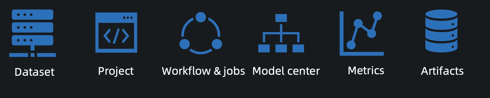
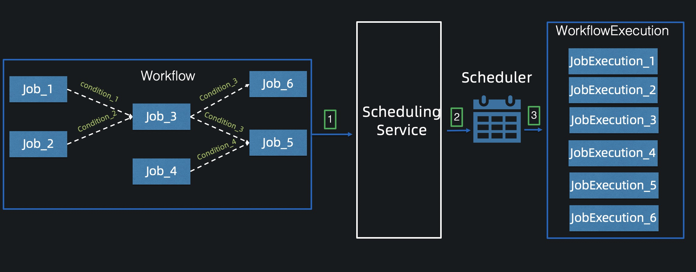

# AIFlow Server
AIFlow Server provides metadata management and scheduling services.

## Meta Service

Meta Service: Provides the CRUD(Create, Read, Update and Delete) service of metadata.

It manages metadata of below entities:

1. Dataset: It contains data address, data format and other information.
2. Project: It contains project name, project description and other information.
   Users can organize the machine learning workflow with it.
3. Workflow: It contains the metadata of workflow that user submitted.
4. Model: It contains the description information of the model and the version information of the model.
5. Metric: It provides model's metric and dataset's metric.
6. Artifact: Configuration files, jar packages etc.

## Scheduling Service

Scheduling Service: The Scheduling Service takes responsibility of operating Workflow by interacting with the scheduler, 
such as submitting workflow, stopping workflow, etc.

The following figure shows the steps of submitting a workflow:

1. The user submits a workflow to the Scheduling Service.
2. The Scheduling Service submits a workflow to the scheduler.
3. The scheduler schedules the workflow, such as running jobs, stopping jobs, etc.