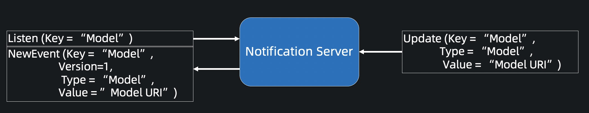

# Notification Server

The figure below shows its working steps:

1. A consumer listens the event which the key field equals 'Model'.
2. A producer sends the event to the Notification Server.
3. The consumer received the event, and then processes the received event according to the consumer's logic.

The scenarios of the Notification Server in the AIFlow system are as follows:
1. Sending/listening events for the scheduler. 
   For example, when a job ends, it will send a job finished event, 
   and the scheduler will perform the corresponding scheduling action.
   
2. Sending/listening events for the Meta Service.
   For example, when a user registers a new model version, the Meta Service will send a new model version event.
   
3. Sending/listening events for the Jobs.
   For example, when a model evaluation job ends, 
   an event will be generated that represents the result of the model evaluation. 
   When the downstream job receives this event, it will perform the corresponding action.
   
4. Sending/listening events for the external system.
   The external system can send or listen to some user-defined events.