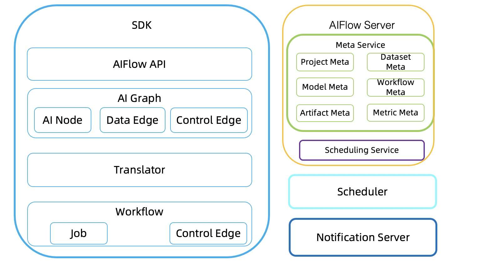
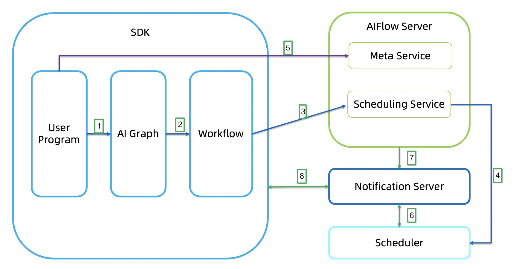

# Overview

## Overall Architecture

The overall architecture of AIFlow is shown in the figure below:

AIFlow consists of components: AIFlow SDK, AIFlow Server, Notification Server, Scheduler.

1. __SDK__: AIFlow SDK provides the API of workflow operation and the client of the Meta Service and Scheduling Service.
   The SDK mainly consists of four parts: AIFlow API, AI Graph, Translator and Workflow.
   
    * __AIFlow API__:  AIFlow API provides the functions like defining a machine learning workflow,
      workflow operation(submit, start, stop, etc.), sending/listening events, managing the metadata.

    * __AI Graph__: AI Graph is a logical graph generated by the user-defined AIFlow application.
      
    * __Workflow__: Workflow defines a set of execution rules for Jobs.
      
    * __Translator__: Translator converts an AI Graph to a Workflow.
   
2. __AIFlow Server__: AIFlow Server provides metadata management and scheduling services.

3. __Notification Server__: Notification Server provides capabilities the event publishing and subscription.

4. __Scheduler__: Scheduler provides the function of executing workflow.

## How AIFlow Works

The figure below shows how AIFlow works:

1. Generates an AI Graph by the AIFlow API.
2. Translates an AI Graph to a Workflow.
3. Submits the Workflow to Scheduling Service and register metadata to Meta Service.
4. Scheduling Service calls scheduler to execute workflow.   
5. When the Scheduler runs the workflow, it will publish and subscribe events to Notification Server.
6. AIFlow server sends events to Notification Server, such as model version generation events, etc.
