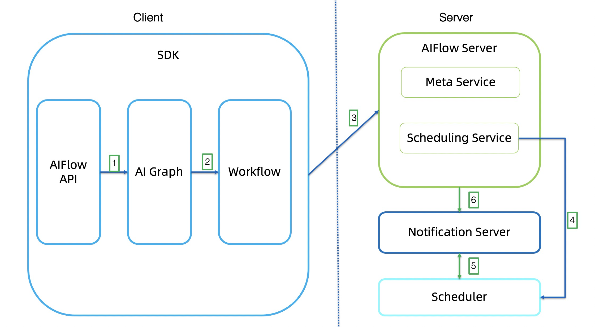
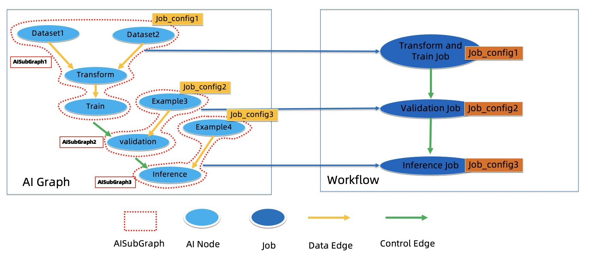

# Overview

## Architecture
 
The overall architecture of AIFlow is shown in the figure below:

AIFlow consists of components: AIFlow SDK, AIFlow Server, Notification Server, Scheduler.

1. __SDK__: AIFlow SDK provides the API of workflow operation and the client of the Meta Service and Scheduling Service.
   The SDK mainly consists of four parts: AIFlow API, AI Graph, Translator and Workflow.
   
    * __AIFlow API__:  AIFlow API provides the functions like defining a machine learning workflow,
      workflow operation(submit, start, stop, etc.), sending/listening events, managing the metadata.

    * __AI Graph__: AI Graph is a logical graph generated by the user-defined AIFlow application.
      
    * __Workflow__: Workflow defines a set of execution rules for Jobs.
      
    * __Translator__: Translator converts an AI Graph to a Workflow.
   
2. __AIFlow Server__: AIFlow Server provides metadata management and scheduling services.

3. __Notification Server__: Notification Server provides capabilities the event publishing and subscription.

4. __Scheduler__: Scheduler provides the function of executing workflow.

## How AIFlow Works

The figure below shows how AIFlow works:

1. Generates an AI Graph by the AIFlow API.
2. Translates an AI Graph to a Workflow.
3. Submits the Workflow to Scheduling Service.
4. Scheduling Service calls scheduler to execute workflow.   
5. Optionally the client can register metadata.
6. When the Scheduler runs the workflow, it will publish and subscribe events to Notification Server.
7. AIFlow server sends events to Notification Server, such as model version generation events, etc.

## SDK
SDK is used to develop the AIFlow programs.
The following section explains in detail the functions included in the SDK.

### API
API mainly includes 3 categories:
1. Workflow Definition.
2. Metadata management.
3. Workflow operation.

### AI Graph

AI Graph: As shown in the figure below, it consists of AI Node, Data Edge and Control Edge . 

1. AI Node: It defines a machine learning logical operation, such as transformation, training etc.
   A group of AI Nodes compose a job with a job config, and the AI Nodes in a group can only be connected by the DataEdges.
2. Data Edge: The Data Edge connects two AI Nodes, 
   indicating that the downstream AI Node depends on the data produced by the upstream AI Node.
3. Control Edge：Control Edge represents the condition under which a job action should be triggered. 
   The events that trigger the job action can come from the job in the same workflow or from an external system.
   
### Workflow

Workflow composes of Jobs and Control Edges.

1. Job：It is the unit that the scheduler can run. A job has a job config which describes job's static properties.
2. Control edge: It represents the condition under which a job action should be triggered. 

### Translator

Translator: It converts an AI Graph to a Workflow.

The translator works in the following steps:
1. A group of AI Nodes with the same job config are combined into an AISubGraph.
2. It converts all AISubGraphs to the corresponding Jobs.
3. Add all Control Edges to the Workflow.

## AIFlow Server
AIFlow Server provides metadata management and scheduling services.

### Meta Service

Meta Service: Provides the CRUD(Create, Read, Update and Delete) service of metadata.

It manages metadata of below entities:

1. Dataset: It contains data address, data format and other information.
2. Project: It contains project name, project description and other information.
   Users can organize the machine learning workflow with it.
3. Workflow: It contains the metadata of workflow that user submitted.
4. Model: It contains the description information of the model and the version information of the model.
5. Metric: It provides model's metric and dataset's metric.
6. Artifact: Configuration files, jar packages etc.

### Scheduling Service

Scheduling Service: The Scheduling Service takes responsibility of operating Workflow by interacting with the scheduler, 
such as submitting workflow, stopping workflow, etc.

The following figure shows the steps of submitting a workflow:

1. The user submits a workflow to the Scheduling Service.
2. The Scheduling Service submits a workflow to the scheduler.
3. The scheduler schedules the workflow, such as running jobs, stopping jobs, etc.

## Notification Server

The figure below shows its working steps:

1. A consumer listens the event which the key field equals 'Model'.
2. A producer sends the event to the Notification Server.
3. The consumer received the event, and then processes the received event according to the consumer's logic.

The scenarios of the Notification Server in the AIFlow system are as follows:
1. Sending/listening events for the scheduler. 
   For example, when a job ends, it will send a job finished event, 
   and the scheduler will perform the corresponding scheduling action.
   
2. Sending/listening events for the Meta Service.
   For example, when a user registers a new model version, the Meta Service will send a new model version event.
   
3. Sending/listening events for the Jobs.
   For example, when a model evaluation job ends, 
   an event will be generated that represents the result of the model evaluation. 
   When the downstream job receives this event, it will perform the corresponding action.
   
4. Sending/listening events for the external system.
   The external system can send or listen to some user-defined events.

## Scheduler

The common scheduler could only support the scheduling of the batch jobs(It means that after upstream job finished, downstream jobs could run.) 
but in the online learning scenario where we have jobs that will never finish, it does not meet the demand. 
So The scheduler must support event-based scheduling.

The figure below shows the difference between traditional scheduling and event-based scheduling:

With the common scheduler, after upstream jobs finished, downstream jobs can run.
As shown above, after Job_1 and Job_2 are finished,Job_3 can run. 
After Job_3 and Job_4 are finished, Job_5 can run. 
After Job_3 is finished, Job_6 can run.

With the event-based scheduler, after receiving necessary events, downstream jobs can run.
As shown above, After receiving event_1 and event_2, Job_3 can run.
After receiving event_3 and event_4, Job_5 can run.
After receiving event_5, Job_6 can run.

At present, the default scheduler is an [event-based scheduler](https://github.com/flink-extended/ai-flow/tree/master/lib/airflow),
which is based on airflow.