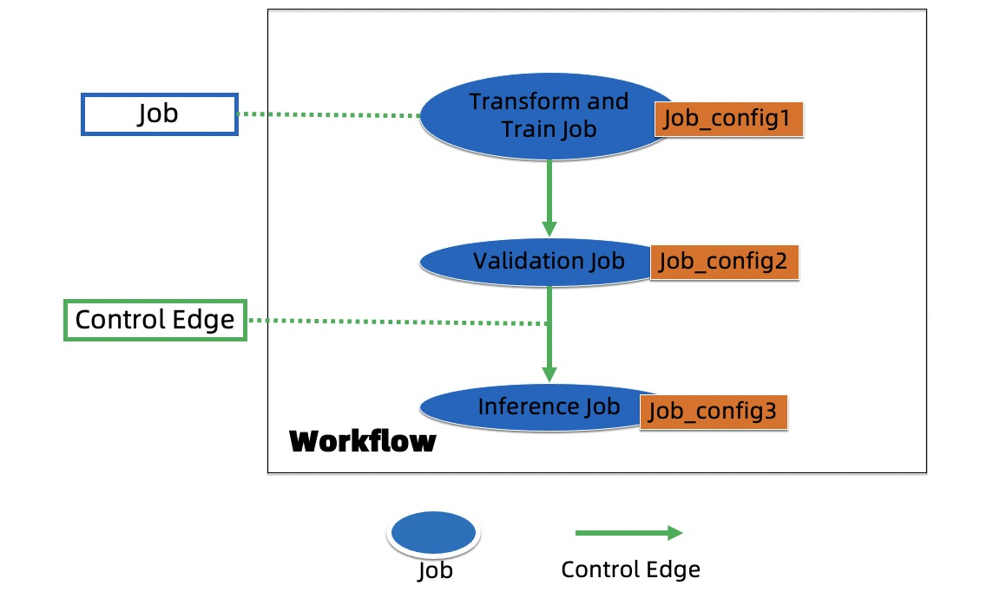
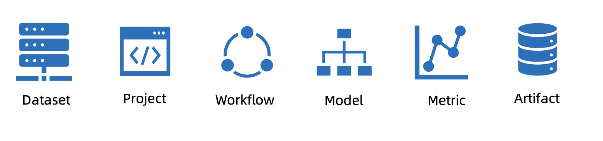
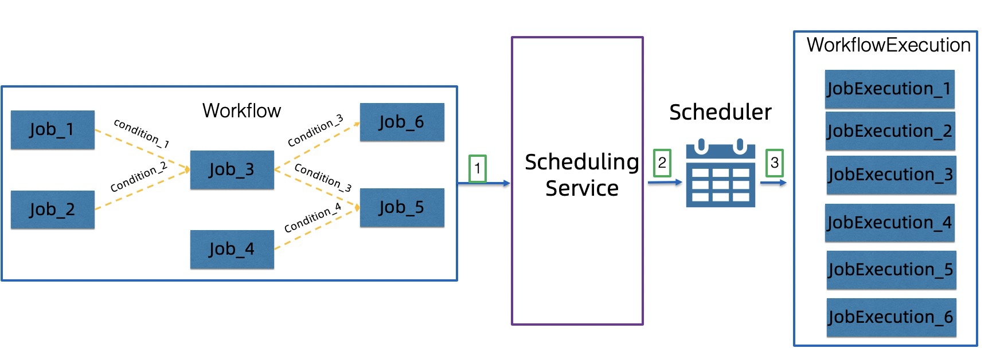
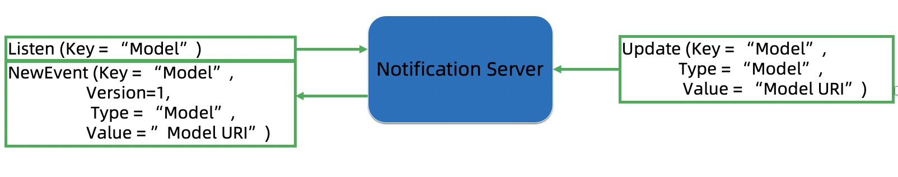

# Design

## Introduction

AIFlow is an open source platform to manage the machine learning lifecycle, including feature engineering, 
model training, model evaluation, model serving, model inference, metric monitoring, etc.

## Architecture
 
The following figure shows the components of AIFlow:

AIFlow consists of three parts: SDK, AIFlow Server, Notification Server and Scheduler.

1. __SDK__: Define how to build a machine learning workflow and the client api of Meta Service
   and Scheduler Service. The SDK consists of four parts: AIFlow API, AI Graph, Translator and Workflow.
   
    * __AIFlow API__:  The functions it provides are: defining a machine learning workflow,
      controlling workflow  (submit, run, stop, etc.), sending/listening event, managing meta-information 
      and developing plugins.

    * __AI Graph__: AI Graph is a logical calculation graph generated by the user-defined AIFlow program. 
      
      AI Nodes, Data Edges and Control Edges compose AI Graph.
      
      * AI Node: It defines the calculation logic in the machine learning process. 
      
      * Data Edge: It defines the data dependency between AI Nodes.
      
      * Control Edge: It describes the event trigger conditions for controlling Job.
      
    * __Workflow__: Workflow defines a set of execution rules for Jobs.
      
      Jobs and Control Edges compose the Workflow. 
      
      * Job: It is a description of an executable unit converted from a set of AI Nodes with the same job configuration. 
      
      * Control Edge: It describes the event trigger conditions for controlling Job.
      
    * __Translator__: The role of the Translator is to convert the AI Graph defined by the AIFlow program 
      into a Workflow.
   
2. __AIFlow Server__: AIFlow Server provides meta information management and scheduling services.
   * __Meta Service__: Meta service is responsible for managing meta information of AIFlow project. 
     It includes dataset meta, model meta, job meta, artifact meta, metric meta and project meta, etc.
     
   * __Scheduling Service__: Scheduling Service is responsible for processing requests to submit workflow, 
     run workflow, stop workflow, etc.

3. __Notification Server__: Notification Server provides event listening and notification functions.

4. __Scheduler__: Scheduler provides the function of executing workflow.

## Principle

The figure below shows the principle of AIFlow:

1. AI Graph represents the user-defined AIFlow program.
2. Translates AI Graph to a Workflow that can be managed by Scheduler Service.
3. Client submits Workflow to Scheduling Service.
4. Scheduling Service calls scheduler to execute workflow.   
5. User programs can register meta information.
6. When the Scheduler runs the workflow, 
   it will send events to Notification Server and listen to the events from Notification Server.
7. Meta Service sends events to Notification Server, such as model version generation events, etc.
8. User programs can also send events to Notification Server or listen to events from Notification Server.

## SDK
SDK is provided by AIFlow to develop the AIFlow programs.
The following section explains in detail the functions included in the SDK.

### AIFlow API

AIFlow API is the interface provided by AIFlow to users.
AIFlow API mainly includes 4 categories:
1. Definition of machine workflow:
   Users can define the workflow of a machine learning project.
2. Meta-information addition, deletion and modification:
   Users can manage meta-information, such as project meta-information, data meta-information, model meta-information, etc.
3. Machine learning workflow life cycle management:
   Users can manage machine learning workflows, such as submitting workflows, running workflows, stopping workflows, etc.
4. Plugin extension:
   Users can extend through the plugin interface. 
   The functions that support extensions are: JobPlugin, Scheduler and BlobManager. 
   The plugin will be explained in detail later.
   

### AI Graph

AI Graph: As shown in the figure below, it consists of AI Node, Data Edge and Control Edge . 

1. AI Node: It defines a type of machine learning logical operation, such as transformation, training etc.
   A Job Config is associated with a group of AI Nodes, and the AI Nodes in a group can only be connected by the DataEdges.
2. Data Edge: The Data Edge connects two AI Nodes, 
   indicating that the downstream AI Node depends on the data produced by the upstream AI Node.
3. Control Edge：Control Edge represents the condition under which a job action should be triggered. 
   The events that trigger the job action can come from the job in the same workflow or from an external system.

### Workflow

Workflow defines a set of execution rules for Jobs.

Jobs and Control Edges make up a Workflow.

1. Job：It is the unit that the scheduler can run.
2. Control edge: It represents the condition under which a job action should be triggered. 

### Translator

Translator: It converts the AI Graph into the Workflow that the scheduler can execute.

The working steps of the translator are as follows:
1. A group of AI Nodes with the same job config are combined into an AISubGraph.
2. Call the corresponding JobGenerator according to the job config to convert all AISubGraphs to the corresponding Jobs.
3. Add all Control Edges to the Workflow.

## AIFlow Server
AIFlow Server provides meta information management and scheduling services.

### Meta Service

Meta Service: Provides the CRUD(Create, Read, Update and Delete) service of metadata generated in the workflow of machine learning tasks.

The services provided are shown in the figure below:

1. Dataset: It provides dataset meta-information services, including data address, data format and other information.
   Users can define the program for reading and writing data according to it.
2. Project: It provides project meta-information services, 
   including project name, project description and other information.
   Users can organize the machine learning workflow of different projects based on it.
3. Workflow&Jobs: It provides workflows and jobs meta-information services, 
   including workflow description, job description and other information.
   Users can view the submitted workflow's meta-information, 
   and the job's meta-information according to it.
4. Model Center: It provides Models meta-information services.
   It contains the description information of the model and the version information of the model.
5. Metric: It provides metric meta-information services, such as model version evaluate metric, etc.
6. Artifacts: It provides artifacts meta-information services such as configuration files, jar packages etc.

### Scheduling Service

Scheduling Service: The Scheduling Service converts the workflow into an object that can be recognized by the scheduler 
and submits it to the scheduler.
The traditional scheduler can only schedule batch jobs (when upstream job finished then downstream jobs can run) 
but in the online learning scenario where we have jobs that will never finish, it does not meet the demand. 
The scheduler for Scheduler Service docking must support event-based scheduling.

The following figure shows the principle of Scheduler Service:

1. The user submits Workflow to the Scheduler Service.
2. The Scheduler Service forwards user requests to the scheduler based on event scheduling.
3. The scheduler manages the behavior of Workflow, such as running jobs, stopping jobs, etc.

## Notification Server

Notification Server: It is a service that provides event sending and event notification.
The functions of the Notification Server in the AIFlow system are as follows:
1. It provides sending/listening events for the scheduler. 
   For example, when a job ends, it will send an event representing the end of the job, 
   and the scheduler will perform the corresponding scheduling action after receiving this event.
   
2. It provides sending/listening events for the Meta Service.
   For example, a user registers a new model version.
   After receiving the user’s request, 
   the Meta Service will send an event representing the registration of a new model version.
   
3. It provides sending/listening events for the Jobs.
   For example, when a job to evaluate the model ends, 
   an event will be generated that represents the result of the model evaluation. 
   When the downstream job receives this event, it will perform the corresponding action.
   
4. It provides sending/listening events for the external system.
   The external system can send or listen to some user-defined events.

The figure below shows its working steps:

1. A consumer listens the event which the key field equals 'Model'.
2. A producer sends the event to the Notification Server.
3. The consumer received the event, and then processes the received event according to the consumer's pre-defined logic.

## Scheduler

Scheduler: Scheduler is responsible for executing workflow and must support event-based scheduling.
Currently, we have implemented an [event-based scheduler](https://github.com/flink-extended/ai-flow/tree/master/lib/airflow) by combining AirFlow and Notification Server.

## AIFlow Plugins

AIFlow provides a plug-in interface for easy connection with external systems.
It now provides 3 types of plugin interfaces:

1. Scheduler plugin: It provides an interface to integrate with the scheduler. 
   Users can implement this interface to connect to different schedulers, such as AirFlow.
   
   Scheduler plugin interface definition: [Scheduler Interface](https://github.com/flink-extended/ai-flow/tree/master/ai_flow/plugin_interface/scheduler_interface.py)

2. Job plugin: It provides an interface for docking different types of jobs. 
   Users can implement this interface to dock different types of jobs, such as Bash job, Python job, etc.

   Job plugin interface definition: [Job Plugin Interface](https://github.com/flink-extended/ai-flow/tree/master/ai_flow/plugin_interface/job_plugin_interface.py)

3. BlobManager plugin: It provides an interface to store the project code in different media. 
   Users can implement this interface to store the project code in different storage media, such as oss, hdfs, etc.
   
   BlobManager plugin interface definition: [BlobManager Interface](https://github.com/flink-extended/ai-flow/tree/master/ai_flow/plugin_interface/blob_manager_interface.py)
