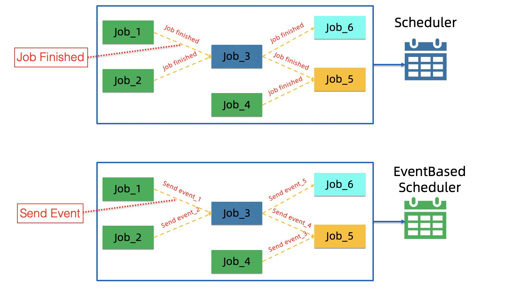

# Scheduler

The common scheduler could only support the scheduling of the batch jobs(It means that after upstream job finished, downstream jobs could run.) 
but in the online learning scenario where we have jobs that will never finish, it does not meet the demand. 
So The scheduler must support event-based scheduling.

The figure below shows the difference between traditional scheduling and event-based scheduling:

With the common scheduler, after upstream jobs finished, downstream jobs can run.
As shown above, after Job_1 and Job_2 are finished,Job_3 can run. 
After Job_3 and Job_4 are finished, Job_5 can run. 
After Job_3 is finished, Job_6 can run.

With the event-based scheduler, after receiving necessary events, downstream jobs can run.
As shown above, After receiving event_1 and event_2, Job_3 can run.
After receiving event_3 and event_4, Job_5 can run.
After receiving event_5, Job_6 can run.

At present, the default scheduler is an [event-based scheduler](https://github.com/flink-extended/ai-flow/tree/master/lib/airflow),
which is based on airflow.