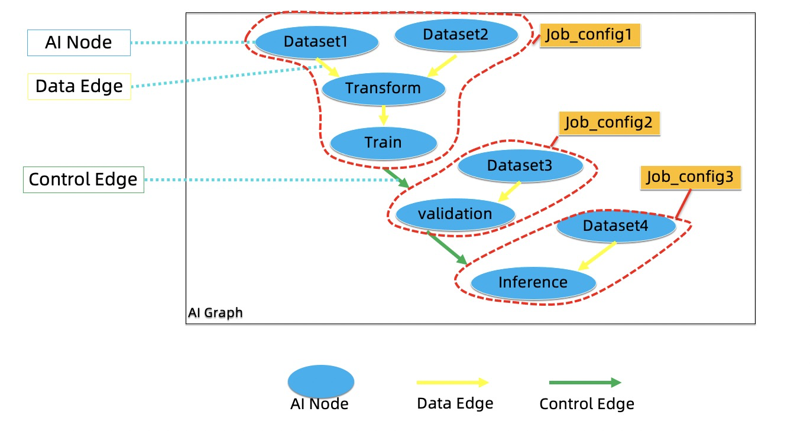

# SDK
SDK is used to develop the AIFlow programs.
The following section explains in detail the functions included in the SDK.

## API
API mainly includes 3 categories:
1. Workflow Definition.
2. Metadata management.
3. Workflow operation.

## AI Graph

AI Graph: As shown in the figure below, it consists of AI Node, Data Edge and Control Edge . 

1. AI Node: It defines a machine learning logical operation, such as transformation, training etc.
   A group of AI Nodes compose a job with a job config, and the AI Nodes in a group can only be connected by the DataEdges.
2. Data Edge: The Data Edge connects two AI Nodes, 
   indicating that the downstream AI Node depends on the data produced by the upstream AI Node.
3. Control Edge：Control Edge represents the condition under which a job action should be triggered. 
   The events that trigger the job action can come from the job in the same workflow or from an external system.
   
## Workflow

Workflow composes of Jobs and Control Edges.

1. Job：It is the unit that the scheduler can run. A job has a job config which describes job's static properties.
2. Control edge: It represents the condition under which a job action should be triggered. 

## Translator

Translator: It converts an AI Graph to a Workflow.

The translator works in the following steps:
1. A group of AI Nodes with the same job config are combined into an AISubGraph.
2. It converts all AISubGraphs to the corresponding Jobs.
3. Add all Control Edges to the Workflow.