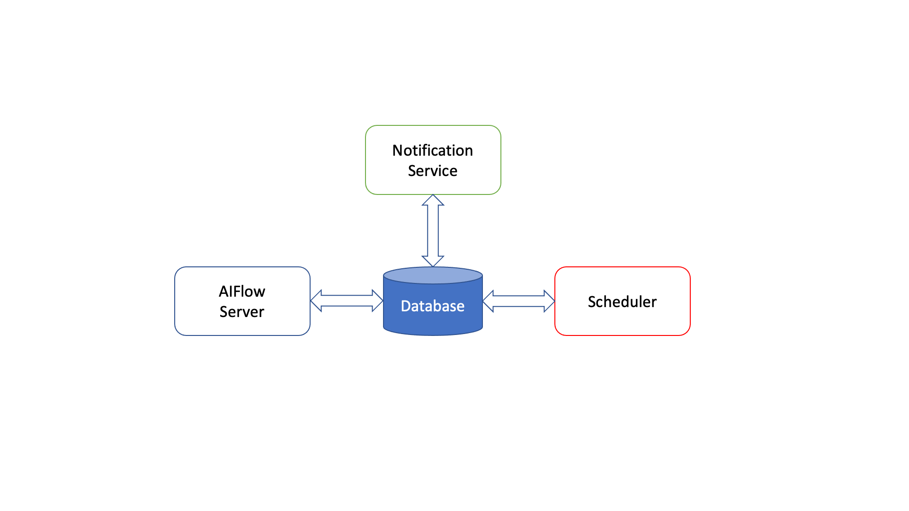

# Overview

AIFlow is a platform that consists of multiple components, AIFlow Server, Notification Server and Scheduler. The image
below shows the components of an AIFlow deployment.

AIFlow Server is the main component, which is responsible for submitting workflows to the scheduler, manage the life
cycle of the workflows, and bookkeeping the metadata of the AIFlow projects. Notification service is used to handle
event sending and event listening. The scheduler should support event-based scheduling and is responsible for scheduling
the workflow. All the components above need a database, and we use sqlite by default. For more detail explanations of each
component, please refer to [Architecture Overview](../architecture/overview.md).



## Installation

Before deploying, please make sure you have followed the [Installation Guide](./installation.md) to install AIFlow.

## Standalone Deployment

Here we show you how to set up an AIFlow Standalone Cluster.

```{note}
Since both AIFlow Server, Airflow scheduler and Airflow web server are all depending on the Notification Server,
Notification Server needs to start first.
```

### Deploying Notification Server
Please follow [Deploying Notification Server](./deploying_notification_server.md) for details.

```{note}
Currently, AIFlow Server and Airflow scheduler share a directory so that AIFlow Server can submit Airflow dag files to 
Airflow scheduler. Therefore, it requires deploying AIFlow Server and Airflow scheduler on the same machine.
```

### Deploying AIFlow Server

Please follow [Deploying AIFlow Server](./deploying_aiflow_server.md) for details.

### Deploying Scheduler

We use enhanced Airflow as our event-based scheduler. Please follow [Deploying Scheduler](./deploying_scheduler.md) for details.
