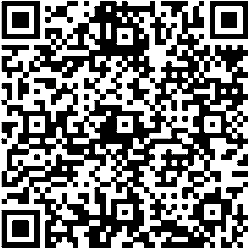

# Contribution Guide

## Pull Request Checklist

Before sending your pull requests, make sure you followed this list.

- Read [[Contribution]].
- Open an issue (https://github.com/flink-extended/ai-flow/issues)
- Create a personal fork of the project on Github.
- Clone the fork on your local machine. Your remote repo on Github is called `origin`.
- Add the original repository as a remote called `upstream`.
- If you created your fork a while ago be sure to pull upstream changes into your local repository.
- Create a new branch to work on! Branch from `master`.
- Implement/fix your feature, comment your code.
- Run tests.
- Write or adapt tests as needed.
- Add or change the documentation as needed.
- Create a new branch.
- Push your branch to your fork on Github, the remote `origin`.
- From your fork open a pull request in the correct branch. Go for `master`!
- Wait for approval.
- Once the pull request is approved and merged you can pull the changes from `upstream` to your local repo and delete your extra branches.

### Prerequisites

1. Python
2. Java
3. Maven

### Establish Development Environment

We strongly recommend using [virtualenv](https://virtualenv.pypa.io/en/latest/index.html) or other similar tools for an isolated Python environment in case of dependencies conflict error, e.g.

```shell
python3 -m venv /path/to/new/virtual/environment
source /path/to/new/virtual/environment/bin/activate
```

Now you can configure it as the Project Interpreter if you are using PyCharm as your IDE.

### Run Tests

You can run the shell script `run_tests.sh` to verify the modification of AI Flow. 

If you modified the bundled Airflow, you need to add relevant test cases and run tests according to [Airflow contributing guidelines](flink-ai-flow/lib/airflow/CONTRIBUTING.rst).

If you modified the bundled Notification Services, you need to add relevant test cases to `lib/notification_service/tests/test_notification.py` and run the test script.

### Contact Us

For more information, you can join the **AI Flow Users Group** on [DingTalk](https://www.dingtalk.com) to contact us.
The number of the DingTalk group is `35876083`. 

You can also join the group by scanning the QR code below:


