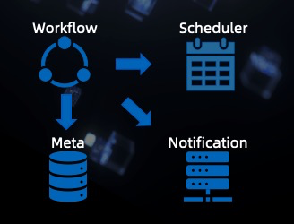

# What's Flink AI Flow

## Introduction
Flink AI Flow is an open source framework that bridges big data and artificial intelligence. 
It manages the entire machine learning project lifecycle as a unified workflow, including feature engineering, 
model training, model evaluation, model service, model inference, monitoring, etc. 
Throughout the entire workflow, Flink is used as the general purpose computing engine.

In addition to the capability of orchestrating a group of batch jobs, 
by leveraging an event-based scheduler(enhanced version of Airflow), 
Flink AI Flow also supports workflows that contain streaming jobs. Such capability is quite useful for complicated
real-time machine learning systems as well as other real-time workflows in general.

## Features
You can use Flink AI Flow to do the following:

1. Define the machine learning workflows including batch/stream jobs.

2. Manage metadata(generated by the machine learning workflow) of datasets, models, artifacts, metrics, jobs etc.

3. Schedule and run the machine learning workflows from end to end.

4. Publish and subscribe various events and take corresponding actions.

To support online machine learning scenarios, notification service and event-based schedulers are introduced.
Flink AI Flow's current components are:

1. SDK: It defines how to build a machine learning workflow and contains the api of the Flink AI Flow.

2. Notification Service: It provides event listening and notification functions.

3. Metadata Service: It stores and serves the metadata of the datasets, projects and workflows.

4. Event-Based Scheduler: It is a pluggable component that take scheduling actions based on the received events in the system.

## Documentation

### QuickStart

You can follow our [[Quick Start]] to get your hands on AI Flow quickly. Besides, you can also take a look at our 
[[Tutorial]] to learn how to write your own workflow.

### API

Please refer to the [[Python API]] to find the details of the API supported by Flink AI Flow.

### Design

If you are interested in design principles of Flink AI Flow, please see the [[Design]] for more details.

### Examples

We have provided some examples of Flink AI Flow to help you get a better understanding of how to write a workflow.
Please see the [Examples](https://github.com/flink-extended/ai-flow/tree/master/examples) directory.

## Reporting bugs

If you encounter any issues please open an issue in GitHub and we encourage you to provide a patch through GitHub pull request
as well.

## Contributing

We happily welcome contributions to Flink AI Flow. Please see our [[Contribution]] for details.

## Contact Us

For more information, you can join the **Flink AI Flow Users Group** on [DingTalk](https://www.dingtalk.com) to contact us.
The number of the DingTalk group is `35876083`. 

You can also join the group by scanning the QR code below:

