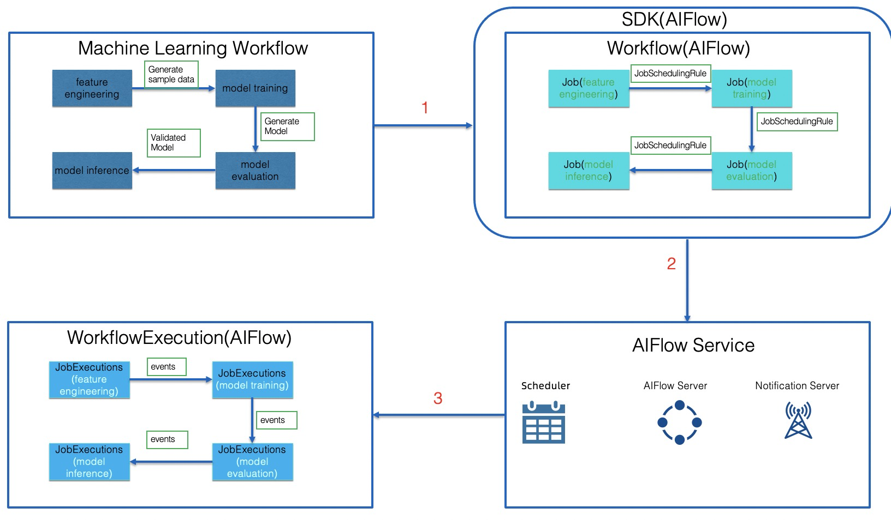
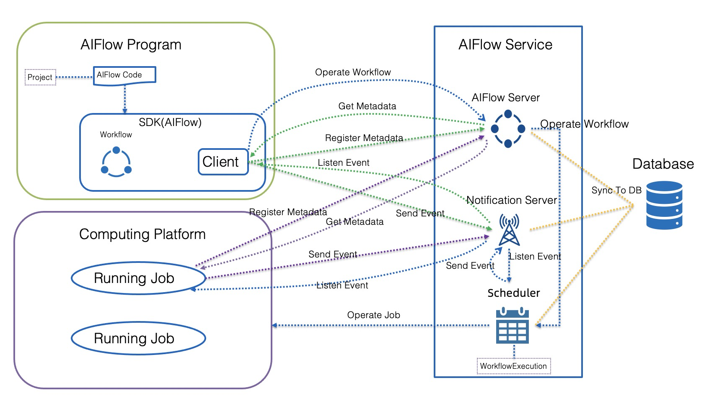

# Concepts

## Overview
AIFlow is an open source platform to manage the machine learning lifecycle, including feature engineering, 
model training, model evaluation, model serving, model inference, metric monitoring, etc.

Using AIFlow, there is an example as the figure below shows:



As shown in the **Machine Learning Workflow**, a machine learning workflow consists of 4 stages: 
feature engineering, model training, model evaluation, and model inference.

The running logic of these four stages is: 
1. Produces the sample data in the feature engineering stage.
2. Trains the model based on the sample data and generates new models in the model training stage. 
3. Evaluates the metrics of new models in the model evaluation stage. 
4. If the new model's metrics meet the conditions, the new model will be used in the model inference.

Users can define the machine learning workflow as AIFlow's [Workflow](#workflow) with the [AIFlow SDK](#sdk).

As shown in **Workflow**:
* [Workflow](#workflow) defines the entire lifecycle of a machine learning workflow. 
* [Job](#job) defines an executable unit in the stage of the machine learning workflow.
* [Control Edges](#control-edge) define the execution relationship between the jobs.
* [Job Scheduling Rule](#job-scheduling-rule) of Control Edge represents the rules for downstream job scheduling.

The workflow contains four jobs feature engineering job, model training job, model evaluation job, model inference job.

The workflow defines the scheduling logic of jobs:
1. The feature engineering job sends a sample generation event to trigger model training job execution.
2. The model training job sends a model generation event to trigger model evaluation job execution.
3. The model evaluation job sends a model validated event to trigger model inference job execution.

As shown in **AIFlow Service**: AIFlow Service consists of AIFlow Server, Notification Server, Scheduler.

Using the [AIFlow SDK](#sdk-aiflow) users can do: 
1. Register metadata of dataset, model, workflow, etc to [AIFlow Serve](#aiflow-server).
2. Send the requests of the workflow operation to [AIFlow Serve](#aiflow-server).
3. Send/Listen [events](#event) to/from [Notification Server](#notification-server).

As shown in **WorkflowExecution**: 
[Scheduler](#scheduler) schedules the machine learning workflow defined by [Workflow](#workflow) as [WorkflowExecution](#workflowexecution).

The scheduler schedules the JobExecution by received events.

The example shows that users can use AIFlow to manage the machine learning workflow lifecycle.

## Architecture
This section contains an overview of AIFlow’s architecture and describes how its main components manage the machine learning lifecycle.



AIFlow code is organized as [Project](#project).

AIFlow code defines the machine learning workflow as a [Workflow](#workflow) with [SDK(AIFlow)](#sdk-aiflow).

The Client is used to interact with [AIFlow Service](#aiflow-service).

The AIFlow Service consists of [AIFlow Server](#aiflow-server), [Notification Server](#notification-server), [Scheduler](#scheduler).

At runtime [AIFlow Server](#aiflow-server), [Notification Server](#notification-server), [Scheduler](#scheduler) synchronize their states to the database.

The [Scheduler](#scheduler) listen to events from [Notification Server](#notification-server) and determine whether it needs to schedule workflows and jobs.
For example, when the scheduler received a model created event, it trigger a model evaluation job execution.

At the same time, the scheduler also send scheduling events to [Notification Server](#notification-server), such as a job finished event.
The [Scheduler](#scheduler) schedules [Workflow](#workflow) and [Job](#job) according to the received events.

The user can register/get metadata(Dataset, Project, Workflow, Model, Artifact, Metric) to/from the [AIFlow Server](#aiflow-server) with the client.

The user can send/listen [events](#event) to/from [Notification Server](#notification-server) with the client.

The user can submit the [Workflow](#workflow) to the [AIFlow Server](#aiflow-server) 
and manage the behavior of [Workflow](#workflow), such as running a job, stopping a job, etc with the client.

When a user submits a workflow to AIFlow Server, the AIFlow Server converts the workflow into an executable workflow and submits it to the [Scheduler](#scheduler).

When the scheduler schedules a workflow, it creates a [WorkflowExecution](#workflowexecution).
Then the scheduler submit [Jobs](#job) to the [Computing Platform](#computing-platform) according to the rules defined by the [Control Edge](#control-edge).

[Running Job](#running Job) can register/get metadata to/from the [AIFlow Server](#aiflow-server).
[Running Job](#running Job) can send/listen events to/from the [Notification Server](#notification-server).

## Glossary

### Project
An AIFlow project contains the definitions of multiple machine learning workflows, 
resources (jar package, python package, etc.), project configuration files, etc.
The directory structure of an AIFlow project:
```text
SimpleProject
        |- workflows # Directory for storing workflow definitions
           |- workflow_name1 # Is a directory store workflow named workflow_name1.
           |- workflow_name2 # Is a directory store workflow named workflow_name2.
           |- workflow_name3 # Is a directory store workflow named workflow_name3.
              |- workflow_name3.py # Workflow defined file.
              |- workflow_name3.yaml # Workflow configuration file.
        |- dependencies # Resource storage directory on which workflow execution depends.
            |-python # Python file resource storage directory on which workflow execution depends.
            |-jar # Jar resource storage directory on which workflow execution depends.
            |-go #  Go resource storage directory on which workflow execution depends.
        |- generated # The File storage directory generated in the process of translator generating workflow.
        |- resources # Store the resource files of the project.
        └─ project.yaml # The project configuration file.
```

### SDK
SDK is provided by AIFlow to develop the AIFlow programs.

For more details, you can refer to [SDK](../architecture/overview.html#sdk).

### Event
Event means that something happened in machine learning workflow, such as a sample data created, a new model created.

### Job
Job is the unit that the scheduler can schedule.

### Control Edge
Control edge represents the condition under which a job action should be triggered.

### Job Scheduling Rule
JobSchedulingRule represents the rules for downstream job scheduling.

### Workflow
Workflow defines a set of execution rules for Jobs.

Jobs and Control Edges make up a Workflow.

### JobExecution
A JobExecution represents an instance of a running [Job](#job).

### WorkflowExecution
A WorkflowExecution represents an instance of a running [Workflow](#workflow).

### AIFlow Service
AIFlow Service represents the services needed to run AIFlow programs.
AIFlow Service consists of AIFlow Server, Notification Server, Scheduler.

### AIFlow Server
AIFlow Server provides meta information management and scheduling services.

* Meta Service: Meta service is responsible for managing meta information of AIFlow projects. 
  The metas in Meta Service include the meta of the dataset, model, project, workflow, artifact and metric.
    
* Scheduling Service: Scheduling Service is responsible for processing requests to submit workflow, 
  run workflow, stop workflow, etc.
  
For more details, you can refer to [AIFlow Server](../architecture/overview.html#aiflow-server).

### Notification Server

Notification Server: It provides Notification Service that supports the event publishing and subscription.
For more details, you can refer to [Notification Server](../architecture/overview.html#notification-server).

### Scheduler
Scheduler: Scheduler is responsible for scheduling the workflow.

For more details, you can refer to [Scheduler](../architecture/overview.html#scheduler).

### Computing Platform
Computing Platform is a system that can run jobs, such as apache yarn(Mapped Reduce Job), flink cluster(Flink Job).

### Running Job
Running Job represents an instance of job execution, such as a MappedReduce job, a Flink job.
