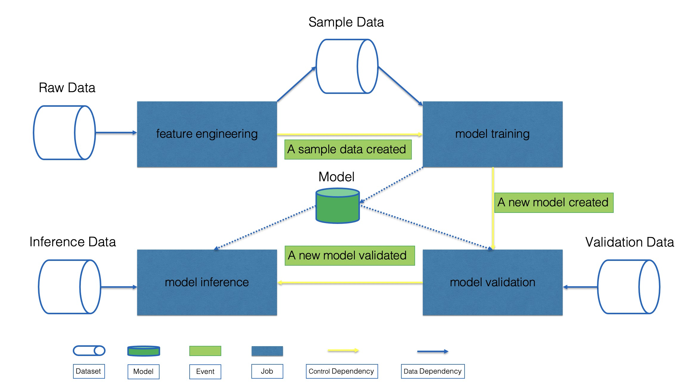

# Concepts

A machine learning workflow includes feature engineering, model training, model validation, model serving, 
model inference, metric monitoring, etc.

The figure below shows a common machine learning workflow:

The workflow consists of 4 stages: feature engineering, model training, model validation, and model inference.

1. Feature engineering produces the sample data from the raw data.
2. Model training trains models based on the sample data and generates new models. 
3. Model validation validates the metrics of new models from the validation data. 
4. If the new model's metrics meet the conditions, model inference will use the new model to do inference work from inference data.

## Project
A project contains multiple business related workflows.

For example, we can have a project that consists workflows for a recommendation system and another project with 
workflows for risk controlling system.

## Workflow
A workflow consists of [jobs](#job) and relationships([data dependencies](#data-dependency) 
and [control dependencies](#control-dependency)) between jobs.

A workflow can run regularly or be triggered by [events](#event).

## Job
A Job is the basic unit of execution in workflow. Jobs are arranged into a workflow, 
and they have relationships between them in order to express the conditions on which they should run.
For example, a workflow contains feature engineering job, model training job, 
model validation job, and model inference job.

## Job Action
A job action contains creating a job execution, stopping a job execution and restarting a [job execution](#job-execution).

## Event
The event specifies the signal that triggers the [job action](#job-action).

For example, feature engineering job execution produces a sample data created event and 
model validation job execution produces a new model validated event.

## Data Dependency
The data dependency indicates the [job](#job) in the workflow depends on certain [datasets](#dataset).
For example, model training job depends on a sample data created by the feature engineering job.

## Control Dependency
The control dependency indicates conditions under which a [job action](#job-action) should be triggered.

For example, after the feature engineering job finished, 
the sample data created event will trigger the model training job to run.

## Workflow Execution
The workflow execution is a runtime instance of the [workflow](#workflow).
A workflow can be executed multiple times to generate multiple workflow executions.

## Job Execution
The job execution is a runtime instance of the [job](#job).
A job can be executed multiple times to generate multiple job executions.

## Dataset
A dataset represents the data that can be processed by jobs like feature engineering, model training, etc.
For example, datasets used in the above example contain raw data, sample data, etc.

## Model
A model is the output of a machine learning algorithm run on [the sample data](#dataset).

## Metric
The metric is a measure of certain characteristics of [dataset](#dataset) or [model](#model).
The metric contains the dataset's metric(such as data null rate), the model's metric(such as AUC of the model).

## Artifact
The artifact represents the additional resource files(except dataset, model) required by the workflow, such as dictionaries, jar packages, etc.
