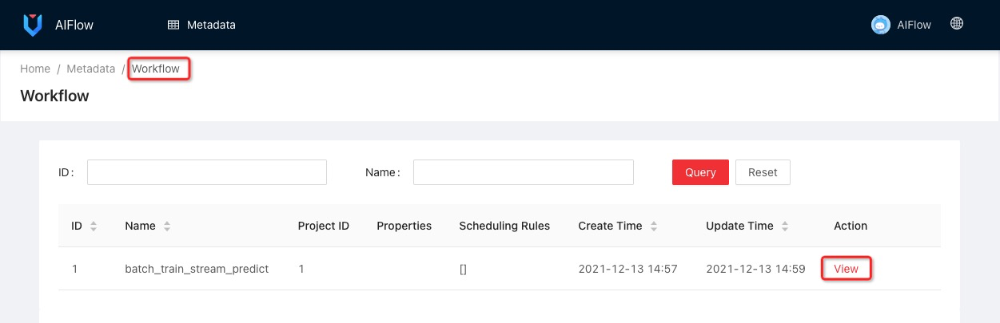

# Quickstart

The Quickstart will show you how to start AIFlow and help you get started with an example in AIFlow.

## Start AIFlow

### Start AIFlow Locally

Note: running AIFlow locally requires that you have [AIFlow installed](../deployment/installation.md) on your workstation.

AIFlow contains three long-running servers, 
AIFlow Server, Notification server and Scheduler(Apache Airflow by default).
You can start all servers with a single script `start-all-aiflow-services.sh` as below:.

```shell
start-all-aiflow-services.sh
```

It will take a few minutes to start all servers for the first time. Once all servers have started, you will get the output like:

```text
Starting Notification Server
...
...
All services have been started!
```

### Start AIFlow in Docker

You can also start AIFlow in Docker if you don't want to install AIFlow locally. 
Please run following commands to enter the docker container in interactive mode and start servers inner docker. 

```shell script
docker run -it -p 8080:8080 -p 8000:8000 flinkaiflow/flink-ai-flow:latest /bin/bash
start-all-aiflow-services.sh
```

## View Web Server

Once all servers started, you can visit the AIFlow Web [[http://127.0.0.1:8000](http://127.0.0.1:8000)] with the default username(admin) and password(admin):


Since Apache Airflow is the [Scheduler](../architecture/overview.md) by default, you can visit the Airflow Web [[http://127.0.0.1:8080](http://127.0.0.1:8080)] 
with the default username(admin) and password(admin) to view the execution of workflows:


## Run Sklearn Example

We have prepared some [examples](https://github.com/alibaba/flink-ai-extended/releases/download/ai-flow-release-0.2.2/ai-flow-examples.tar.gz) to get started. . 
You can run following commands to download the examples and run the sklearn example.

```shell
curl -Lf https://github.com/flink-extended/ai-flow/releases/download/release-0.3.0/examples.tar.gz -o /tmp/ai-flow-examples.tar.gz
tar -zxvf /tmp/ai-flow-examples.tar.gz -C /tmp
python /tmp/examples/sklearn_examples/workflows/batch_train_stream_predict/batch_train_stream_predict.py
```

The example shows how to define an entire machine learning workflow through AIFlow. 
You can view the workflow definition in batch_train_stream_predict.py. 
The workflow contains four jobs, including sklearn model batch training, batch validation, model pushing and streaming prediction.

You can see the workflow metadata, and the graph of the workflow on the AIFlow web frontend: [http://127.0.0.1:8000](http://127.0.0.1:8000).




You can click task view to jump to the workflow execution page:


In the above figure, you can see that the model batch training triggers the model validation with the `MODEL_GENERATED` 
event after the sklearn model generated. After passing the model validation, 
the model pushing is triggered by the `MODEL_VALIDATED` event. 
The model streaming prediction is triggered by the `MODEL_DEPLOYED` event.

For more details about how to write your workflow, please refer to the [Tutorial](../workflow_development/tutorial.md) document.

## Stop AIFlow

Run following command to stop all services:

```shell
stop-all-aiflow-services.sh
```

## Troubleshooting

### 1. pytz.exceptions.UnknownTimeZoneError: 'Can not find any timezone configuration'

It is a common problem in Ubuntu, the solution is setting the locale environment variable correctly, e.g.
```
export TZ=America/Indiana/Indianapolis
```

### 2. ValueError: unknown locale: UTF-8

You may meet this error with earlier version of Python, please set the environment variables like below.

```text
export LANGUAGE=en_US.UTF-8
export LANG=en_US.UTF-8
export LC_ALL=en_US.UTF-8
export LC_CTYPE=en_US.UTF-8
export LC_MESSAGES=en_US.UTF-8
```
