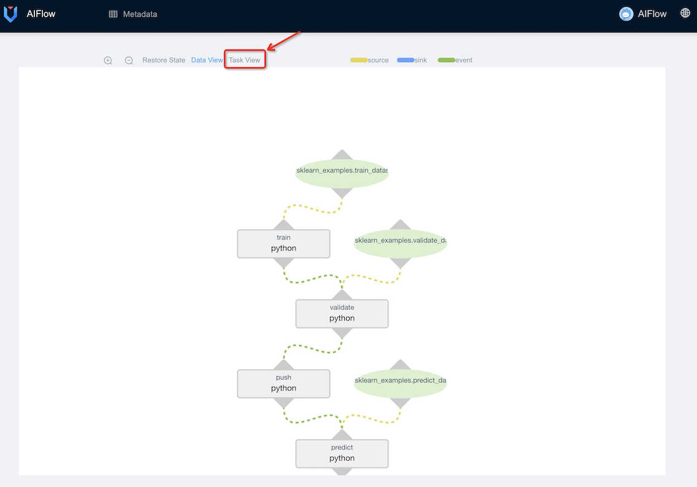

# Running AIFlow locally

This section will show you how to install and start AIFlow on your local workstation.

## Installing AIFlow
Please make sure that you have installed AIFlow refer to [installation guide](../../installation.md).


## Starting AIFlow 

AIFlow contains three long-running servers, AIFlow Server, Notification server and Scheduler(Apache Airflow by default).
You can start all servers with a single script `start-all-aiflow-services.sh` as below:.

```shell
start-all-aiflow-services.sh
```

It will take a few minutes to start all servers for the first time. Once all servers have started, you will get the output like:

```text
...
...
All services have been started!
```
```{note}
You may run into issues caused by different operating systems or versions, 
please refer to [Troubleshooting](./troubleshooting.md) section to get solutions.
```
## Viewing Web Server

Once all servers started, you can visit the AIFlow Web [[http://127.0.0.1:8000](http://127.0.0.1:8000)] with the default username(admin) and password(admin):


Since Apache Airflow is the [Scheduler](../architecture/overview.md) by default, you can visit the Airflow Web [[http://127.0.0.1:8080](http://127.0.0.1:8080)] 
with the default username(admin) and password(admin) to view the execution of workflows:


## Downloading the Quickstart
Download the quickstart code by cloning AIFlow via 

```shell
git clone https://github.com/flink-extended/ai-flow.git
```
Now cd into the `examples` subdirectory of the repository. We’ll use this working directory for running the quickstart.

## Installing Extra Dependencies
To run the quickstart and other examples, we need to install some extra dependencies by following command:
```shell script
pip install 'ai-flow[example_requires]'
```

## Running the Quickstart

Now you can run following commands to submit a machine learning project to AIFlow server.

```{note}
AIFlow will search the project in current directory when submit workflow, so before running following commands, please make sure you are in the `examples` directory of the repository you just cloned.
```

```shell
# Submit workflow to AIFlow Server
aiflow workflow submit sklearn_examples batch_train_stream_predict

## Force start an execution
aiflow workflow start-execution sklearn_examples batch_train_stream_predict
```

The example shows how to define an entire machine learning workflow through AIFlow. You can view the workflow definition in [batch_train_stream_predict.py](https://github.com/flink-extended/ai-flow/tree/master/examples/sklearn_examples/workflows/batch_train_stream_predict). The workflow contains four jobs, including sklearn model batch training, batch validation, model pushing and streaming prediction.

You can see the workflow metadata, and the graph of the workflow on the AIFlow web frontend: [http://127.0.0.1:8000](http://127.0.0.1:8000).




You can click task view to jump to the workflow execution page:


In the above figure, you can see that the model batch training triggers the model validation with the `MODEL_GENERATED` 
event after the sklearn model generated. After passing the model validation, the model pushing is triggered by the `MODEL_VALIDATED` event. The model streaming prediction is triggered by the `MODEL_DEPLOYED` event.

## What’s Next?

For more details about how to write your own workflow, please refer to the [tutorial](../../tutorial_and_examples/tutorial.md) and  [development](../../development/index.md) document.
