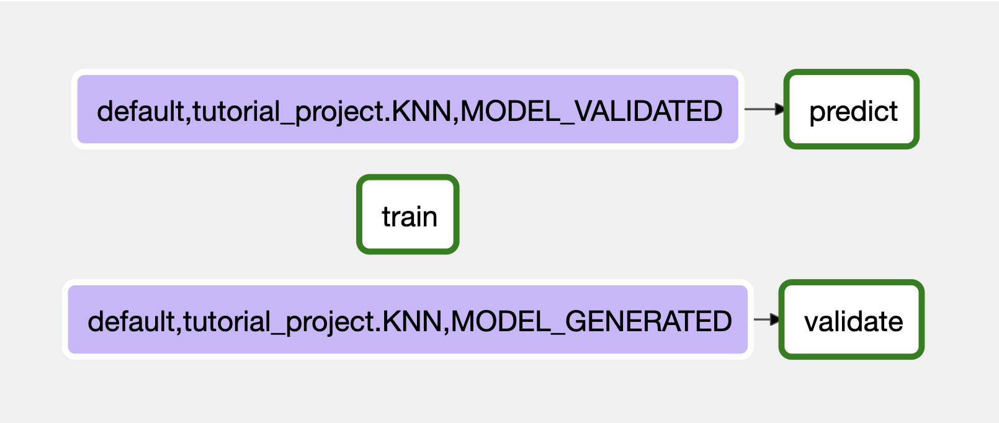
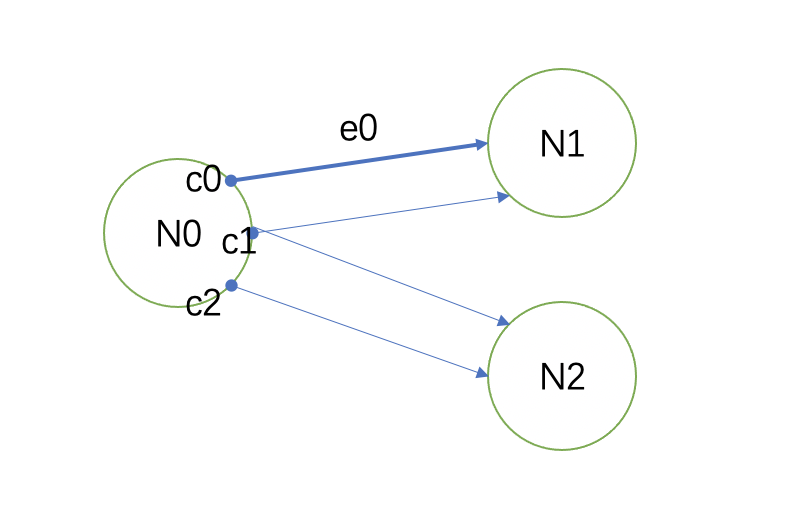

# Tutorial

This tutorial will show you how to create and run a workflow using AIFlow SDK and walk you through the fundamental AIFlow concepts and their usage.
In the tutorial, we will write a simple machine learning workflow to train a KNN model using iris training dataset and verify the effectiveness of the model. 

Furthermore, in this workflow, the training job will be a periodical batch job using scikit-learn library. 
Once the batch training job finishes, we will start a validation job to validate the correctness and generalization ability of the generated model. 
Finally, when a model is validated, we will start a Flink job to utilize the model to do prediction and save prediction results to a local file.

## Running the Example

Before running the example, please download the [tutorial_project](https://github.com/flink-extended/ai-flow/tree/master/examples/tutorial_project) directory to local
and make sure you have installed AIFlow and started AIFlow Server, Notification Server and Scheduler correctly according to the [QuickStart](../get_started/quickstart/index.md) document.

Now, run the follow commands to run the example.

1. Register datasets, artifact and model:
```shell
python tutorial_project/workflows/tutorial_workflow/init_env.py
```

2. Submit the tutorial_workflow to AIFlow Server:
```shell
aiflow workflow submit ${tutorial_project absolute path} tutorial_workflow
```

3. Start a new execution of tutorial_workflow:
```shell
aiflow workflow start-execution ${tutorial_project absolute path} tutorial_workflow
```

Once the bash command returns(it should take no longer than 1 minute), go to check the Airflow WebUI to see if the workflow is submitted successfully. 
If it is success, wait a minute(because we set the training job to be executed every 1 minute in the config file) then you can see the graph like this:



You can view the prediction output under in the file `/tmp/tutorial_output/predict_result.csv` as well.

If you want to view logs, you can go to check logs under directory like `${AIFLOW_HOME}/logs/tutorial_project/tutorial_workflow/`. 
The log files will give you the information in detail. Also, checking the log in the Airflow WebUI is also a good choice.

Now let's explain the above example.

## Project Directory Structure

The tutorial_project's directory structure is as follows:

```
tutorial_project/
        |- workflows/
           |- tutorial_workflow/
              |- tutorial_workflow.py 
              |- tutorial_workflow.yaml 
        |- dependencies/
            |-python 
            |-jar
        |- resources/
        └─ project.yaml
```

`tutorial_project` is the root directory of the project and `workflows` is used to save codes and config files of workflows in this project. 

The `dependecies` directory is used to save python/jar dependencies that will be used by our workflow.

The `resources` directory is for saving all other files(e.g., config files) that will be used by the project.

The `project.yaml` is the project config file. 


## Configure the tutorial_project

This is the project.yaml for tutorial project:

```yaml
project_name: tutorial_project
server_uri: localhost:50051
notification_server_uri: localhost:50052
blob:
  blob_manager_class: ai_flow_plugins.blob_manager_plugins.local_blob_manager.LocalBlobManager
```

In `project_name`, we define the project's name, which will be the default namespace of workflows in this project as well. 

```{note}
Namespace in AIFlow is used for isolation. Each workflow can only send events to its own namespace while it can listen on multiple namespaces. 
The reason for enabling listening on multiple namespaces is that the workflow could be triggered by external events from Notification Server.
```
For `server_uri`,  they tell where the AIFlow Server is running on.

For `notification_server_uri`,  they tell where the Notification Server is running on.

Then, we configure the `blob` property which specifies where the workflow code will be updated when submitting. 
It also tells the AIFlow Server where and how to download the workflow code.

Here we choose to use `LocalBlobManager` and as a result, the AIFlow Server will download the workflow code locally. 
Please note that `LocalBlobManager` can only work when you submit your workflow on the same machine as the AIFlow server.


## Define the tutorial_workflow

There is a `tutorial_workflow` directory for our workflow. 
In the `tutorial_workflow.py`, we defined the workflow and `tutorial_workflow.yaml` configure the tutorial_workflow.

```{note}
The names of 'tutorial_workflow.py' and 'tutorial_workflow.yaml' must be same as the name of 'tutorial_workflow' directory.
```

### 1. Register Metadata

Now, we introduce how to register the datasets, artifact and model which the tutorial_workflow used in init_env.py.

```python
import os
import ai_flow as af
from ai_flow.api.ai_flow_context import ensure_project_registered
from ai_flow.context.project_context import init_project_config

DATASET_URI = os.path.abspath(os.path.join(__file__, "../../../../")) + '/dataset_data/iris_{}.csv'
artifact_prefix = "tutorial_project."
project_path = os.path.abspath(os.path.join(__file__, "../../../"))
output_path = '/tmp/tutorial_output'


def init():
    if not os.path.exists(output_path):
        os.makedirs(output_path)
    # Register metadata of training data(dataset) and read dataset(i.e. training dataset)
    train_dataset = af.register_dataset(name=artifact_prefix + 'train_dataset',
                                        uri=DATASET_URI.format('train'))
    # Register test dataset
    validate_dataset = af.register_dataset(name=artifact_prefix + 'test_dataset',
                                           uri=DATASET_URI.format('test'))

    # Save prediction result
    write_dataset = af.register_dataset(name=artifact_prefix + 'write_dataset',
                                        uri=output_path + '/predict_result.csv')

    validate_artifact_name = artifact_prefix + 'validate_artifact'
    validate_artifact = af.register_artifact(name=validate_artifact_name,
                                             uri=output_path + '/validate_result')

    # Register model metadata and train model
    train_model = af.register_model(model_name=artifact_prefix + 'KNN',
                                    model_desc='KNN model')


if __name__ == '__main__':
    init_project_config(project_path + '/project.yaml')
    ensure_project_registered()
    init()
```
In the above codes, methods like `register_dataset` `register_artifact` and `register_model` 
are just used to save some metadata(e.g., the name of the model, the uri of the artifact or the uri of the dataset) into the database. 
The return value of these methods are some metadata objects(e.g. `DatasetMeta` `ArtifactMeta` or `ModelMeta`), 
which can be used to query metadata or serve as parameters of other methods.

### 2. Configure the Workflow

Now we introduce how to configure the workflow.

```yaml
train:
  job_type: python
  periodic_config:
    interval: '0,0,0,60' # The train job will be executed every 60s
  # properties:
  #  train_param_key: train_param_val

validate:
  job_type: python

predict:
  job_type: flink
  properties:
    run_mode: cluster
    flink_run_args: #The flink run command args(-pym, -pyexec etc.). It's type is List.
      - -pyexec
      - /path/to/bin/python # path to your python3.7 executable path
```

In the tutorial_workflow.yaml, we define the properties of each job. 

For `train` job, its job type is `python`, which means the user defined logic in this job will be executed using `python`. 
Besides, we set the `periodic_config` to be `interval: '0,0,0,60'` which means the job will be executed every 60s. 
The `properties` option which represents the additional properties of the job config can also be configured. 
The `properties` in the job config can be obtained through **`af.current_workflow_config().job_configs['job_name'].properties`**  in the `process` method in the user-defined `PythonProcessor` implementation.

For `validate` job, we only config its job type to be `python`.

For `predict` job, we set its job type to be `flink`, which means this job is a flink job. 
In addition, to use flink, we need to set some flink-specific properties including `run_mode` (cluster or local) and `flink_run_args`. For the `flink_run_args`, we follow the list format of `yaml` to add the args such as the `-pyexec`.


### 3. Define the Workflow

Now we introduce how to define the tutorial_workflow.

#### 1) Init AIFlow

In AIFlow, a workflow is just a Python script. We need to import the libraries and init AIFlow context.

```python
import ai_flow as af
from ai_flow.model_center.entity.model_version_stage import ModelVersionEventType
from tutorial_processors import DatasetReader, ModelTrainer, ValidateDatasetReader, ModelValidator, Source, Sink, \
    Predictor

af.init_ai_flow_context()
```

#### 2) Define a Training Job

In our design, the workflow in AIFlow is a DAG(Directed Acyclic Graph) or to be more specific, it is a [AIGraph](https://github.com/flink-extended/ai-flow/blob/master/ai_flow/ai_graph/ai_graph.py#L28). Each node in the graph is an [AINode](https://github.com/flink-extended/ai-flow/blob/master/ai_flow/ai_graph/ai_node.py#L29), which contains a processor. Users should write their custom logic in the processor. 

In the AIGraph, nodes are connected by 2 types of edges. The first one is named as `DataEdge` which means the destination node depends on the output of the source node. The other is `ControlEdge` which means the destination node depends on the control conditions from source node. We will dive deeper into this kind of edges later.

For now, let's concentrate on the set of AINodes connected by only data edges. Such a set of nodes and data edges between them constitutes a sub-graph. This sub-graph, together with the predefined job config in workflow config yaml, is mapped to a Job by AIFlow framework.

So, to summarize, each AIFlow job is made up of a job config, some AINodes and the data edges between those nodes. 

These concepts seem to be a little difficult, but do not worry. Let's look at some code snippets, and you will find it pretty easy to define a job with provided API of AIFlow.

In the following codes, we define a training job of our workflow:
```python
# Training of model
with af.job_config('train'):
    # Register metadata of training data(dataset) and read dataset(i.e. training dataset)
    train_dataset = af.get_dataset_by_name(dataset_name='tutorial_project.train_dataset')
    train_read_dataset = af.read_dataset(dataset_info=train_dataset,
                                         read_dataset_processor=DatasetReader())

    # Register model metadata and train model
    train_model = af.get_model_by_name(model_name="tutorial_project.KNN")
    train_channel = af.train(input=[train_read_dataset],
                             training_processor=ModelTrainer(),
                             model_info=train_model)
```

The`read_dataset()` and `train()` are `Operators` as they have some specific semantics and will create corresponding `AINodes`. 
Then, how do we define the data dependency of those newly created nodes? 
We just put the output of `read_dataset` method into the `input` arg of `train()` method. 
Such codes imply input of the training node created by`train()` is the output of the node created by `read_dataset()` .  
The return values of methods like `train()` are `Channel` or list of `Channel`s.

In AIFlow, `Channel` represents the output of AINodes. More vividly, `Channel` is one end of the `DataEdge`. 
The following picture shows the relation among `AINodes`, `DataEdges` and `Channels`:



In the example, AINode N0 has 3 outputs(i.e., 3 channels whose source node is N0). We can make N1 accepts the c0 and c1 channels and N2 accepts c1 and c2 channels. Accordingly, there are 4 DataEdges in all. With such design, we can manipulate the data dependencies more flexibly and reuse the data easier.

Currently, the only puzzle left is how to implement the processors including `DatasetReader()` and `ModelTrainer()`. We will introduce them later in [Implements of Processors](implements-of-processors) section. 
Next, let's pay attention to defining the Validation and Prediction jobs.

#### 3) Define the Validation Job and the Prediction Job

Here we define the other two jobs of our workflow. They are pretty similar to what we have done in defining the training job.

```python
# Validation of model
with af.job_config('validate'):
    # Read validation dataset
    validate_dataset = af.get_dataset_by_name(dataset_name='tutorial_project.test_dataset')
    # Validate model before it is used to predict
    validate_read_dataset = af.read_dataset(dataset_info=validate_dataset,
                                            read_dataset_processor=ValidateDatasetReader())
    validate_artifact_name = 'tutorial_project.validate_artifact'
    validate_artifact = af.get_artifact_by_name(artifact_name=validate_artifact_name)
    validate_channel = af.model_validate(input=[validate_read_dataset],
                                         model_info=train_model,
                                         model_validation_processor=ModelValidator(validate_artifact_name))

# Prediction(Inference) using flink
with af.job_config('predict'):
    # Read test data and do prediction
    predict_dataset = af.get_dataset_by_name(dataset_name='tutorial_project.test_dataset')
    predict_read_dataset = af.read_dataset(dataset_info=predict_dataset,
                                           read_dataset_processor=Source())
    predict_channel = af.predict(input=[predict_read_dataset],
                                 model_info=train_model,
                                 prediction_processor=Predictor())
    # Save prediction result
    write_dataset = af.get_dataset_by_name(dataset_name='tutorial_project.write_dataset')
    af.write_dataset(input=predict_channel,
                     dataset_info=write_dataset,
                     write_dataset_processor=Sink())
```

In above codes, we use 3 new predefined operators by AIFlow: `model_validate()` , `predict()`, `write_dataset()`. 

In addition, in AIFlow, if they don't find the operators needed, users can also define their own operators with the `user_define_operation()` API.

#### 4) Define the Relation between Jobs

We now have defined 3 jobs. Each job has some nodes connected by `DataEdge`s. Then we will need to define relations between jobs to make sure our workflow is scheduled and run correctly. The training job will run periodically and once the training finishes, the validation job should be started to validate the latest generated model. If there is a model passes the validation and get deployed, we should (re)start the downstream prediction job to get better inference.

After reviewing above description, we find that some upstream jobs control the downstream jobs. For instance, the training job controls the (re)start of validation job. We keep using AIGraph abstraction to depicts these control relations. But at this time, each AINode in this new AIGraph is a job. Edges to connect these job nodes are named as `ControlEdge`. We also call such control relation as *control dependencies*.

In AIFlow, we implement control dependencies via *Events*. That is, the upstream job can send specific events to downstream jobs and downstream jobs will take actions due to the events and rules defined by users.

```python
# Define relation graph connected by control edge: train -> validate -> predict
af.action_on_model_version_event(job_name='validate',
                                 model_version_event_type=ModelVersionEventType.MODEL_GENERATED,
                                 model_name=train_model.name,
                                 namespace='tutorial_project')
af.action_on_model_version_event(job_name='predict',
                                 model_version_event_type=ModelVersionEventType.MODEL_VALIDATED,
                                 model_name=train_model.name,
                                 namespace='tutorial_project')
```

In above codes, the first `ControlEdge` we defined is that the `validate` 
job (Note, this job name is defined in the yaml file of workflow configs) will be restarted(the default action) when there is a `MODEL_GENERATED` event. 
The second  `ControlEdge` we defined is that the `predict` job will be restarted when there is a `MODEL_VALIDATED` event. 

Besides, the well-defined out-of-box API for managing machine learning jobs, 
AIFlow exposes the most flexible API `action_on_events()` to allow users write their own control dependencies.

(implements-of-processors)=
#### 5) Implements of Processors

As we have mentioned, users need to write their own logic in processors for each job. Currently, AIFlow provides `bash`, `python` and `flink` processors.

The following codes are the `DatasetReader` processor whose type is `python`:

```python
EXAMPLE_COLUMNS = ['sl', 'sw', 'pl', 'pw', 'type']

class DatasetReader(PythonProcessor):

    def process(self, execution_context: ExecutionContext, input_list: List) -> List:
        """
        Read dataset using pandas
        """
        # Gets the registered dataset meta info
        dataset_meta: af.DatasetMeta = execution_context.config.get('dataset')
        # Read the file using pandas
        train_data = pd.read_csv(dataset_meta.uri, header=0, names=EXAMPLE_COLUMNS)
        # Prepare dataset
        y_train = train_data.pop(EXAMPLE_COLUMNS[4])
        return [[train_data.values, y_train.values]]
```

As you can see, it is just a python program using pandas library without any mystery.

Next, we show an example of Flink processors:

```python
class Predictor(flink.FlinkPythonProcessor):
    def __init__(self):
        super().__init__()
        self.model_name = None

    def setup(self, execution_context: flink.ExecutionContext):
        self.model_name = execution_context.config['model_info'].name

    def process(self, execution_context: flink.ExecutionContext, input_list: List[Table] = None) -> List[Table]:
        """
        Use pyflink udf to do prediction
        """
        model_meta = af.get_deployed_model_version(self.model_name)
        model_path = model_meta.model_path
        clf = load(model_path)

        class Predict(ScalarFunction):
            def eval(self, sl, sw, pl, pw):
                records = [[sl, sw, pl, pw]]
                df = pd.DataFrame.from_records(records, columns=['sl', 'sw', 'pl', 'pw'])
                return clf.predict(df)[0]

        execution_context.table_env.register_function('mypred',
                                                      udf(f=Predict(),
                                                          input_types=[DataTypes.FLOAT(), DataTypes.FLOAT(),
                                                                       DataTypes.FLOAT(), DataTypes.FLOAT()],
                                                          result_type=DataTypes.FLOAT()))
        return [input_list[0].select("mypred(sl,sw,pl,pw)")]
```

It is written in Pyflink for convenience and Flink Java Processor is also supported. And to run flink job without bugs, please make sure the properties for running a Flink job is set properly in `tutorial_workflow.yaml` according to your local environment. 

Note, if you use some special dependencies and choose to submit the workflow to a remote environment for execution, you should put your dependencies in the `tutorial_project/dependencies` folder and refer them properly. That's because AIFlow will upload the whole project directory to remote for execution and users need to make sure in the remote env, the python processors can run correctly.

Now we have finished the introduction of how to write a workflow. For the whole codes, please go to check [tutorial_project](https://github.com/flink-extended/ai-flow/tree/master/examples/tutorial_project) directory. After configuring the yaml file according to your own environment, it is time to run the workflow. 

## What's Next

Congratulations! You have been equipped with necessary knowledge to write your own workflow. At the point, you can check [Examples](./examples.md) for more examples and [concepts](../../concepts/index.md) to write your own workflows.
