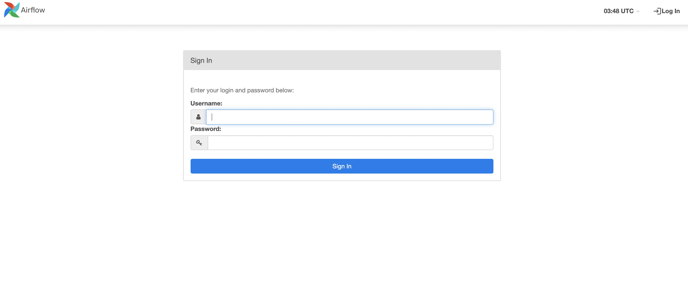

# Background
We provide some examples for using AIFlow, including event-triggered workflow scheduling, 
event-triggered job scheduling, periodic workflow scheduling, periodic job scheduling, etc.

# Start all services
AIFlow contains three long-running servers, 
AIFlow Server, Notification server and Scheduler(Apache Airflow by default).
You can start all servers with a single script `start-all-aiflow-services.sh` as below:.

```shell
start-all-aiflow-services.sh
```

# Check the UI of AIFlow and Airflow
After AIFlow's servers start, you can visit http://localhost:8000/ to view the UI of AIFlow with the default username(admin) and password(admin):

When you see the login UI above, it means that AIFlow has been started.

You can visit http://localhost:8080/ to view the UI of airflow with the default username(admin) and password(admin):

When you see the login UI above, it means that airflow has been started.

Now you can run the examples.

# Submit and Run a Workflow
You can submit a workflow with the command:
```shell
aiflow workflow submit ${project_path} ${workflow_name}
```

You can run a workflow with the command:
```shell
aiflow workflow start-execution ${project_path} ${workflow_name}
```

# Stop all Services
If you want to stop AIFlow's servers, run following command:

```shell
stop-all-aiflow-services.sh
```

# Index of Examples

[bash](workflows/bash)

[python](workflows/python)

[flink](workflows/flink)

[periodic_workflow_interval](workflows/periodic_workflow_interval)

[periodic_workflow_interval](workflows/periodic_workflow_cron)

[periodic_job](workflows/periodic_job)

[job_scheduling_on_status](workflows/job_scheduling_on_status)

[job_scheduling_on_events](workflows/job_scheduling_on_events)

[model_training](workflows/model_training)

[read_only_job](workflows/read_only_job)

[workflow_scheduling_on_events](workflows/workflow_scheduling_on_events)
